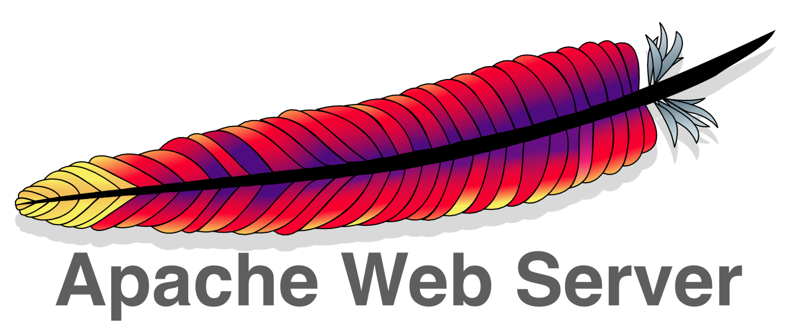

# Hands-on EC2-01 : How to Install Apache Web Server on EC2 Linux 2

Purpose of the this hands-on training is to give the students basic knowledge of how to install Apache Web Server on Amazon Linux 2 EC2 instance. 

## Learning Outcomes

At the end of the this hands-on training, students will be able to;

- demonstrate their knowledge of how to launch AWS EC2 Instance.

- establish a connection with AWS EC2 Instance with SSH.

- install the Apache HTTP Server on Amazon Linux 2 Instance.

- configure the Apache Server to run simple HTML page.

- write a simple bash script to run the Web Server

- automate the process of installation and configuration of a Web Server using the `user-data` script of EC2 Instance.

## Outline

- Part 1 - Getting to know the Apache Web Server

- Part 2 - Launching an Amazon Linux 2 EC2 instance and Connect with SSH

- Part 3 - Installing and Configuring Apache Web Server to Run `Hello World` Page

- Part 4 - Automation of Web Server Installation through Bash Script

## Part 1 - Getting to know the Apache Web Server

The Apache HTTP Server, known as Apache, is a free and open-source cross-platform web server software, which is developed and maintained by an open community of developers under the auspices of the Apache Software Foundation.

## Part 2 - Launching an Amazon Linux 2 EC2 instance and Connect with SSH

- Launch an Amazon EC2 instance with AMI as `Amazon Linux 2`, instance type as `t2.micro` and default VPC security group which allows connections from anywhere and any port.

- Connect to your instance with SSH.

## Installing and Configuring Apache Web Server to Run `Hello World` Page

- Update the installed packages and package cache on your instance.

- Install the Apache Web Server.

- Start the Apache Web Server.

- Check status of the Apache Web Server.

- Set permission of the files and folders under `/var/www/html/` folder to everyone.

- Create a custom `index.html` file under `/var/www/html/` folder to be served on the Server.

- Restart the Apache Web Server.

- Enable the Apache Web Server to survive the restarts.

- Check if the Web Server is working properly from the browser.

## Part 4 - Automation of Web Server Installation through Bash Script

- Configure an Amazon EC2 instance with AMI as `Amazon Linux 2`, instance type as `t2.micro`, default VPC security group which allows connections from anywhere and any port.

- Configure instance to automate web server installation with `user data` script.

- Review and launch the EC2 Instance

- Once Instance is on, check if the Apache Web Server is working from the web browser.

- Connect the Apache Web Server from the terminal with `curl` command.
